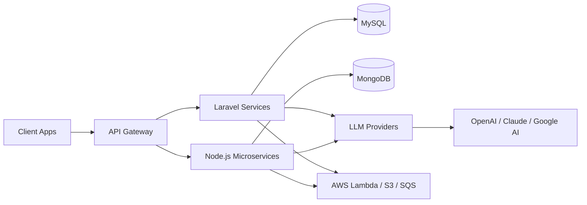

<div align="center">


[](https://git.io/typing-svg)

📍 **Bangalore, India** · 🌐 **[saurabhshukla.com](https://saurabhshukla.com)**

[](https://github.com/saurabhshukla-developer)
[](https://github.com/saurabhshukla-developer?tab=followers)

[](https://linkedin.com/in/saurabhshukla-developer)
[](https://github.com/saurabhshukla-developer)
[](https://saurabhshukla.com)
[](mailto:saurabhshukla.developer@gmail.com)

</div>

---

## 👨‍💻 About Me

```yaml
name: Saurabh Shukla
role: Full Stack Developer
experience: 6+ years
location: Bangalore, India
currently:
  - Building AI-powered solutions
  - Contributing to the Laravel ecosystem
  - Exploring LLM integrations & microservices
interests:
  - Clean architecture
  - Performance optimization
  - Open source
  - Mentoring developers
```

<details>
<summary><b>📖 Click to read more</b></summary>
<br>

I'm a fullstack developer with **6+ years** of experience building robust web applications and APIs. I love turning complex problems into elegant solutions — especially when it involves **microservices**, **AI integration**, or **scalable SaaS architectures**.

When I'm not coding, you'll find me exploring new technologies, contributing to open source, or working on side projects that solve real-world problems.

**Specialties:** Microservices · REST APIs · AI/LLM Integration · Serverless Architecture · Generative AI

</details>

---

## 📊 GitHub Analytics

<div align="center">


</div>

---

## 🛠️ Tech Stack

<div align="center">

### Languages & Frameworks


### Databases & Cloud


</div>

<details>
<summary><b>🧩 Architecture I Love Building</b></summary>
<br>



</details>

---

## 🚀 Featured Projects

<table>
<tr>
<td width="50%">

### 🤖 [AISUME](https://aisume.in/)
**AI Resume Intelligence Platform**

LLM-powered SaaS that analyzes resumes, scores job matches, and generates personalized career suggestions.

`Node.js` `React` `MongoDB` `LLM`

[](https://aisume.in/)

</td>
<td width="50%">

### 🏆 ATS Platform
**Application Tracking System**

Microservices-based ATS with resume parsing, job aggregation, and AI-powered company classification.

`Laravel` `Node.js` `AWS` `SOLR` `Generative AI`

</td>
</tr>
<tr>
<td width="50%">

### 📦 [Laravel AI Chatbot](https://github.com/saurabhshukla-developer/laravel-ai-chatbot)
**Open Source Laravel Package**

Multi-provider AI chatbots with function calling and a beautiful dashboard.

`Laravel` `PHP` `OpenAI` `Claude` `Google AI`

[](https://packagist.org/packages/saurabhshukla-developer/laravel-ai-chatbot)
[](https://packagist.org/packages/saurabhshukla-developer/laravel-ai-chatbot)
[](https://github.com/saurabhshukla-developer/laravel-ai-chatbot)

```bash
composer require saurabhshukla-developer/laravel-ai-chatbot
```

[📖 Docs](https://github.com/saurabhshukla-developer/laravel-ai-chatbot) · [📦 Packagist](https://packagist.org/packages/saurabhshukla-developer/laravel-ai-chatbot)

</td>
<td width="50%">

### 🔭 More on GitHub
Explore all my repositories, contributions, and open-source work.

[](https://github.com/saurabhshukla-developer?tab=repositories)

</td>
</tr>
</table>

---

## 📈 Contribution Activity

<div align="center">


<picture>
  <source media="(prefers-color-scheme: dark)" srcset="https://raw.githubusercontent.com/saurabhshukla-developer/saurabhshukla-developer/output/github-contribution-grid-snake-dark.svg">
  <source media="(prefers-color-scheme: light)" srcset="https://raw.githubusercontent.com/saurabhshukla-developer/saurabhshukla-developer/output/github-contribution-grid-snake.svg">
  
</picture>

</div>

---

## 💡 Random Dev Quote

<div align="center">


</div>

---

## 🤝 Let's Connect

<div align="center">

I'm always open to discussing new projects, creative ideas, or opportunities to collaborate.

[](https://linkedin.com/in/saurabhshukla-developer)
[](https://github.com/saurabhshukla-developer)
[](https://saurabhshukla.com)
[](mailto:saurabhshukla.developer@gmail.com)

<br><br>

```bash
# Let's build something awesome together
curl -X POST "Let's collaborate!" \
  -H "From: curious-developer" \
  -d "project=your-next-big-idea"
```

<br>

⭐️ *If you find my work interesting, consider starring my repositories!*


**Made with ❤️ by [Saurabh Shukla](https://saurabhshukla.com)**

</div>
