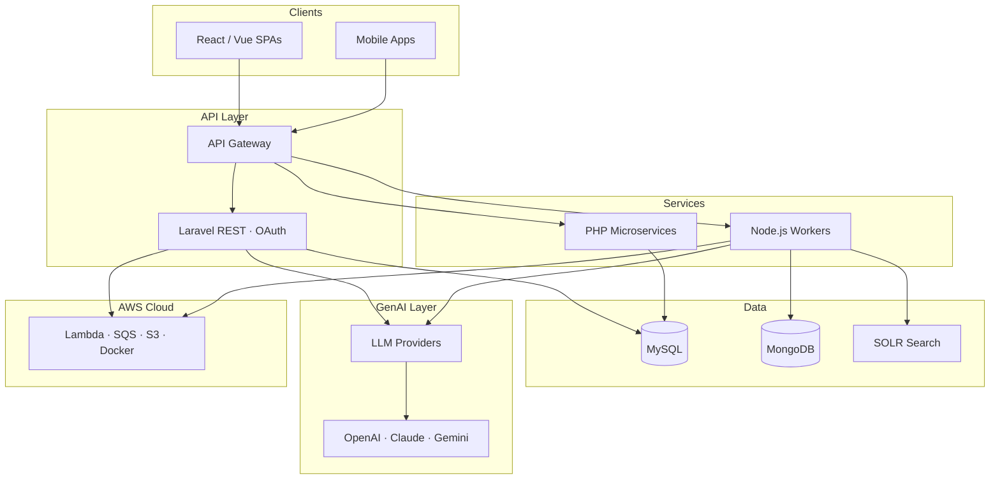
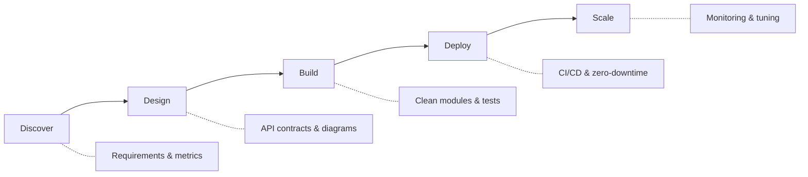

<div align="center">


[](https://git.io/typing-svg)

[](https://saurabhshukla.com)
📍 **Bangalore, India** · 🌐 **[saurabhshukla.com](https://saurabhshukla.com)** · ⚡ **~24h reply time**

[](https://github.com/saurabhshukla-developer)
[](https://github.com/saurabhshukla-developer?tab=followers)

[](https://linkedin.com/in/saurabhshukla-developer)
[](https://github.com/saurabhshukla-developer)
[](https://saurabhshukla.com)
[](https://saurabhshukla.com/blog)
[](mailto:saurabhshukla.developer@gmail.com)

</div>

---

## 👨‍💻 About Me

<table>
<tr>
<td width="55%">

```yaml
name: Saurabh Shukla
role: Senior Software Engineer
location: Bangalore, India 🇮🇳
experience: 6+ years
focus:
  - Full-stack SaaS & REST APIs
  - Microservices & system design
  - GenAI / LLM integrations
current: Tech Staff @ Aissel
philosophy: >
  ship systems that survive
  scale, refactors & 2AM pages
```

</td>
<td width="45%">

```bash
saurabh@github ~ % whoami
→ senior software engineer @ bangalore

saurabh@github ~ % cat stack.json
{
  "core": ["Laravel", "PHP", "MySQL"],
  "frontend": ["React", "Vue.js"],
  "cloud": ["AWS", "Docker"],
  "ai": ["LLM", "GenAI", "RAG"]
}

saurabh@github ~ % ls ./projects/
ATS/  AISUME/  PasswordStack/  SnipURL/

saurabh@github ~ % npm run hire --contact
→ Opening contact form... ✓
```

</td>
</tr>
</table>

<details>
<summary><b>📖 Read the full story</b></summary>
<br>

Senior Software Engineer with **6+ years** of hands-on experience designing scalable web applications using **Laravel**, **PHP**, **Node.js**, and **MySQL**. I architect modular systems, secure REST APIs, and GenAI features that ship to production — not just demos.

When I'm not coding, you'll find me writing on my [blog](https://saurabhshukla.com/blog), speaking at **Laracon India**, exploring LLM tooling, or mentoring developers on clean architecture.

**Specialties:** Microservices · REST APIs · AI/LLM Integration · Serverless · SaaS Architecture · System Design

</details>

> *"I don't just write code — I architect systems that survive scale, refactors, and 2 AM incidents."*
> — **Saurabh Shukla**

---

## 📊 GitHub Analytics

<div align="center">


<br>


<picture>
  <source media="(prefers-color-scheme: dark)" srcset="https://raw.githubusercontent.com/saurabhshukla-developer/saurabhshukla-developer/main/profile-3d-contrib/profile-night-green.svg">
  <source media="(prefers-color-scheme: light)" srcset="https://raw.githubusercontent.com/saurabhshukla-developer/saurabhshukla-developer/main/profile-3d-contrib/profile-green-animate.svg">
  
</picture>

</div>

---

## 🛠️ Tech Stack

<div align="center">


</div>

<div align="center">

| Core | Proficiency | | Core | Proficiency |
|:--|:--|:-:|:--|:--|
| **Laravel** | `▰▰▰▰▰▰▰▰▰▱` 95 | | **GenAI / LLM** | `▰▰▰▰▰▰▰▰▱▱` 88 |
| **PHP** | `▰▰▰▰▰▰▰▰▰▱` 92 | | **Node.js** | `▰▰▰▰▰▰▰▰▱▱` 85 |
| **MySQL** | `▰▰▰▰▰▰▰▰▰▱` 90 | | **AWS** | `▰▰▰▰▰▰▰▱▱▱` 80 |

</div>

<details>
<summary><b>🧩 System Architecture I Ship</b></summary>
<br>



</details>

<details>
<summary><b>🔄 How I Ship — Production SDLC</b></summary>
<br>



</details>

---

## 🚀 Featured Projects

<table>
<tr>
<td width="50%" valign="top">

### 🤖 [AISUME](https://aisume.in/)
**AI Resume Intelligence · Featured**

LLM-powered SaaS with job match scores, ATS compliance, AI cover letters, and career suggestions.

`Node.js` `React` `MongoDB` `LLM`

[](https://aisume.in/)

</td>
<td width="50%" valign="top">

### 🏆 ATS Platform
**Enterprise Application Tracking System · Featured**

Assessment integrations, resume parsing, job aggregation, and AI-powered company classification.

`Laravel` `MySQL` `Node.js` `Microservices` `SOLR` `GenAI`

</td>
</tr>
<tr>
<td width="50%" valign="top">

### 🔐 Password Stack
**Secure Encrypted Vault**

Encrypted password management with tagging, categories, and controlled sharing.

`Laravel` `REST APIs` `Encryption` `Google OAuth`

</td>
<td width="50%" valign="top">

### 🔗 [SnipURL](https://github.com/saurabhshukla-developer)
**URL Shortener + Analytics**

Full-stack shortener with real-time click tracking, IP analytics, and link performance.

`Node.js` `React`

</td>
</tr>
</table>

---

## 📦 Open Source

<table>
<tr>
<td width="50%" valign="top">

### [Laravel AI Chatbot](https://github.com/saurabhshukla-developer/laravel-ai-chatbot)
Multi-provider AI chatbots with function calling and a beautiful dashboard.

[](https://packagist.org/packages/saurabhshukla-developer/laravel-ai-chatbot)
[](https://packagist.org/packages/saurabhshukla-developer/laravel-ai-chatbot)
[](https://github.com/saurabhshukla-developer/laravel-ai-chatbot)

```bash
composer require saurabhshukla-developer/laravel-ai-chatbot
```

[📖 Docs](https://github.com/saurabhshukla-developer/laravel-ai-chatbot) · [📦 Packagist](https://packagist.org/packages/saurabhshukla-developer/laravel-ai-chatbot)

</td>
<td width="50%" valign="top">

### [say-it-now](https://www.npmjs.com/package/say-it-now)
Zero-dependency npm package — micro-response endpoints as a service (no/yes/joke/motivation & more).

[](https://www.npmjs.com/package/say-it-now)
[](https://www.npmjs.com/package/say-it-now)

```bash
npm install say-it-now
```

```javascript
const { sayItNow } = require('say-it-now');
sayItNow('motivation'); // → "You've got this!" 💪
```

[📦 npm](https://www.npmjs.com/package/say-it-now) · [📖 GitHub](https://github.com/packageengine/say-it-now)

</td>
</tr>
</table>

---

## 📝 Latest Blog Posts

*Auto-synced from [saurabhshukla.com/blog](https://saurabhshukla.com/blog) via RSS — updates daily.*

<!-- BLOG-POST-LIST:START -->- [Why I Built AISUME: AI-Powered Resume Analysis and Job Matching](https://saurabhshukla.com/blog/why-i-built-aisume-ai-resume-analysis-job-matching) — *Jul 27, 2026*- [DinePilot is Now Available on Google Play Store 🚀 | Built with Passion for Every Restaurant](https://saurabhshukla.com/blog/dinepilot-now-available-on-google-play-store) — *Jul 27, 2026*- [I Built DinePilot — A Free QR Ordering &amp; Kitchen Display System for Restaurants](https://saurabhshukla.com/blog/dinepilot-qr-ordering-kitchen-display-system-restaurants) — *Jul 10, 2026*- [I Built a Free Expense Splitting App for India — Here&#39;s How SettleUp Works](https://saurabhshukla.com/blog/settleup-free-expense-splitting-app-india) — *Jul 02, 2026*- [Beyond Manual Coding: Master Vibe Coding and AI Agents](https://saurabhshukla.com/blog/beyond-manual-coding-master-vibe-coding-and-ai-agents) — *Jun 13, 2026*<!-- BLOG-POST-LIST:END -->

<div align="center">

[](https://saurabhshukla.com/blog)

</div>

---

## 🏆 Achievements & Milestones

<table>
<tr>
<td align="center">🥇</td>
<td><b>1st Place</b> — IIT Roorkee Techfest (Junkyard War)</td>
</tr>
<tr>
<td align="center">🥇</td>
<td><b>1st Place</b> — IIT Roorkee Techfest (Robotics Competition)</td>
</tr>
<tr>
<td align="center">🥈</td>
<td><b>2nd Place</b> — IIT Bombay Techfest (Big Idea Competition)</td>
</tr>
<tr>
<td align="center">🏅</td>
<td><b>Top 20</b> — V-Guard Big Idea Competition (India)</td>
</tr>
<tr>
<td align="center">🎤</td>
<td><b>Laracon India</b> — Community speaker & Laravel ecosystem contributor</td>
</tr>
</table>

<details>
<summary><b>💼 Career Timeline</b></summary>
<br>

| Period | Role | Company | Focus |
|--------|------|---------|-------|
| **Jun 2025 – Present** | Member of Technical Staff | Aissel Technologies | GenAI product workflows |
| **Jan 2022 – May 2025** | Software Developer | Uplers | Microservices & backend modules |
| **Sep 2020 – Jan 2022** | Software Developer | LadyBirdWeb Solution | Laravel REST APIs |
| **Aug 2019 – Jul 2020** | Software Developer | CasperIndia | Laravel & CodeIgniter |

[](https://saurabhshukla.com)

</details>

---

## 📈 Contribution Activity

<div align="center">


<picture>
  <source media="(prefers-color-scheme: dark)" srcset="https://raw.githubusercontent.com/saurabhshukla-developer/saurabhshukla-developer/output/github-contribution-grid-snake-dark.svg">
  <source media="(prefers-color-scheme: light)" srcset="https://raw.githubusercontent.com/saurabhshukla-developer/saurabhshukla-developer/output/github-contribution-grid-snake.svg">
  
</picture>

</div>

---

## 💡 Random Dev Quote

<div align="center">


</div>

<details>
<summary><b>⏱️ Optional: WakaTime Stats</b> <i>(enable after connecting WakaTime)</i></summary>
<br>

Replace `YOUR_WAKATIME_USERNAME` with your [WakaTime](https://wakatime.com) username and uncomment:

<!--

-->

</details>

<details>
<summary><b>🎵 Optional: Spotify Now Playing</b> <i>(enable with novatorem setup)</i></summary>
<br>

Deploy [Spotify Now Playing](https://github.com/kittinan/spotify-github-profile) and add your endpoint here:

<!--
[](https://open.spotify.com/user/YOUR_SPOTIFY_ID)
-->

</details>

---

## 🤝 Let's Connect

<div align="center">

I'm open to **full-time roles**, **contract work**, and **collaborative product builds** — APIs, microservices, GenAI, and SaaS.

[](https://linkedin.com/in/saurabhshukla-developer)
[](https://github.com/saurabhshukla-developer)
[](https://saurabhshukla.com)
[](https://saurabhshukla.com/blog)
[](mailto:saurabhshukla.developer@gmail.com)

<br><br>

```bash
# Let's build something awesome together
curl -X POST "https://saurabhshukla.com/contact" \
  -H "From: curious-developer" \
  -H "Stack: Laravel | Node | GenAI" \
  -d "project=your-next-big-idea"
```

<br>

⭐️ *If you find my work interesting, consider starring my repositories!*


**Made with ❤️ by [Saurabh Shukla](https://saurabhshukla.com)**

</div>
